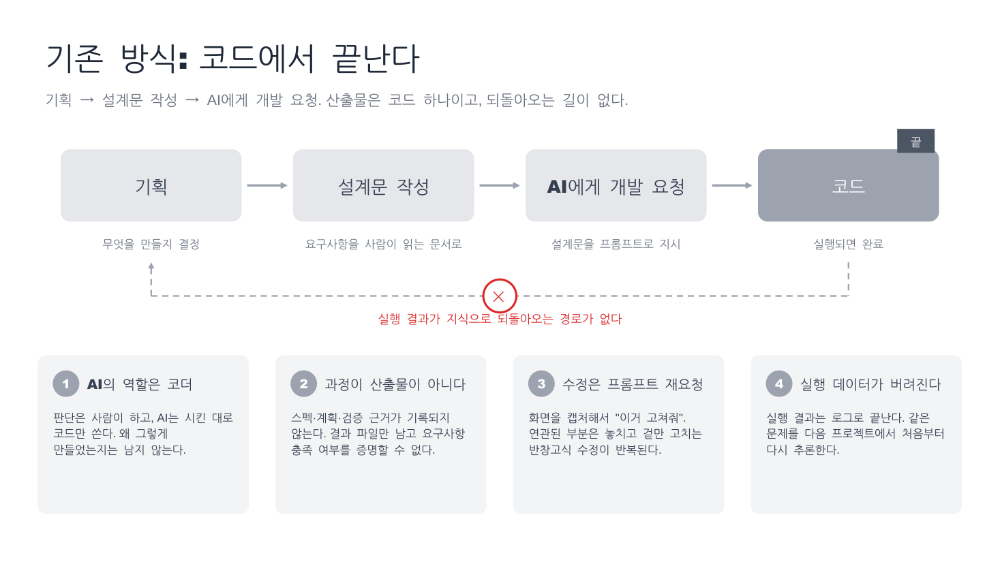
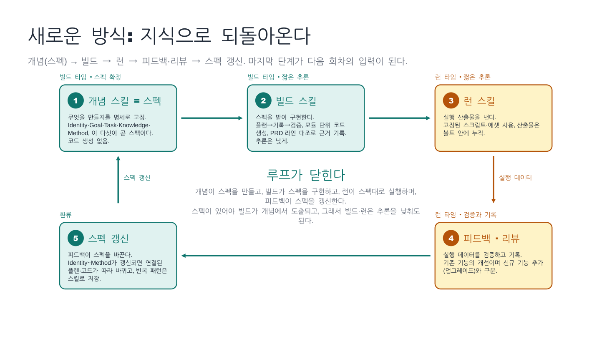
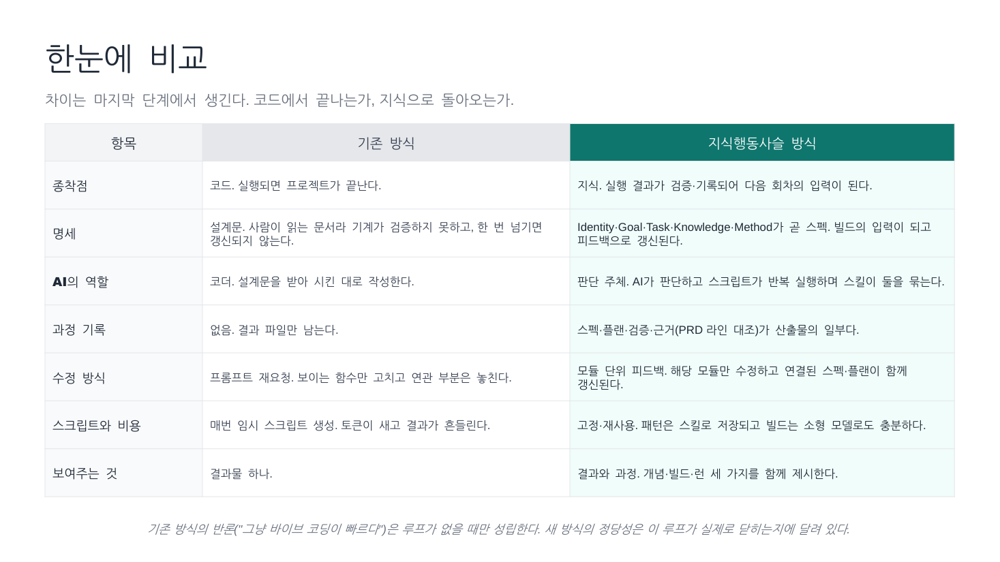

# 개발 방식의 변화

AI를 쓰는 기존 개발 방식과 지식행동사슬 기반 개발 방식을 비교한 자료입니다.

- 기존 방식: 기획 → 설계문 작성 → AI에게 개발 요청 → 코드. 코드가 나오면 끝납니다.
- 새로운 방식: 개념 스킬(스펙) → 빌드 스킬 → 런 스킬 → 피드백·리뷰 → 스펙 갱신. 실행 결과가 다시 스펙으로 돌아와 다음 회차의 입력이 됩니다.

## 자료

- [비교 다이어그램 (PDF, 3장)](docs/dev-method-comparison.pdf)

## 슬라이드 미리보기

### 1. 기존 방식: 코드에서 끝난다

### 2. 새로운 방식: 지식으로 되돌아온다

### 3. 한눈에 비교

## 핵심 정리

| 항목 | 기존 방식 | 지식행동사슬 방식 |
|---|---|---|
| 종착점 | 코드 | 지식(스펙). 실행 결과가 다음 회차의 입력이 된다 |
| 명세 | 사람이 읽는 설계문. 기계가 검증하지 못하고 갱신되지 않는다 | Identity·Goal·Task·Knowledge·Method가 곧 스펙. 빌드의 입력이 되고 피드백으로 갱신된다 |
| AI의 역할 | 코더 | 판단 주체. AI가 판단하고 스크립트가 반복 실행하며 스킬이 둘을 묶는다 |
| 과정 기록 | 없음 | 스펙·플랜·검증·근거가 산출물의 일부 |
| 수정 방식 | 프롬프트 재요청 | 모듈 단위 피드백. 연결된 스펙·플랜이 함께 갱신된다 |
| 스크립트와 비용 | 매번 임시 생성 | 고정·재사용. 빌드·런은 짧은 추론으로 충분하다 |
| 보여주는 것 | 결과물 하나 | 결과와 과정. 개념·빌드·런 세 가지를 함께 제시 |
